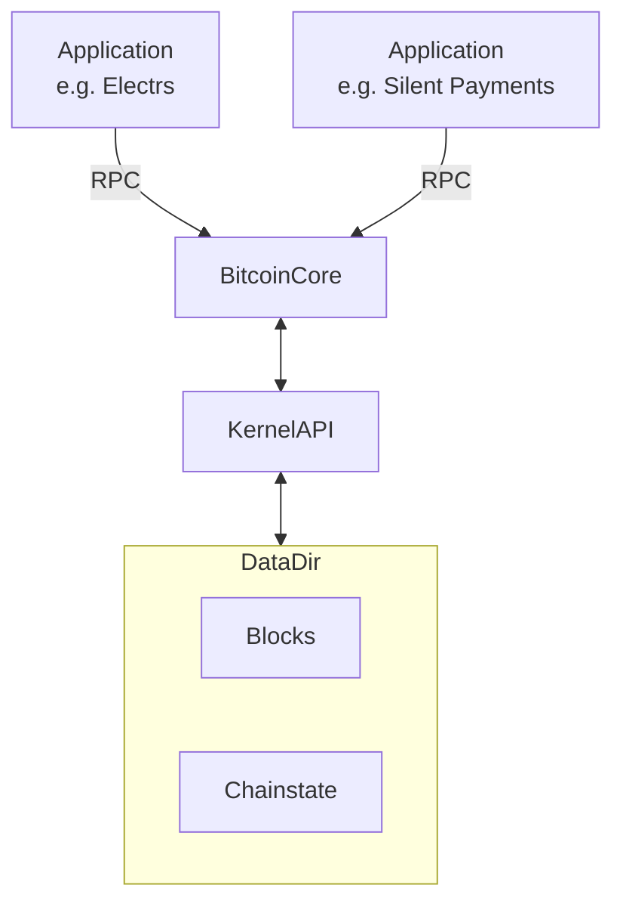
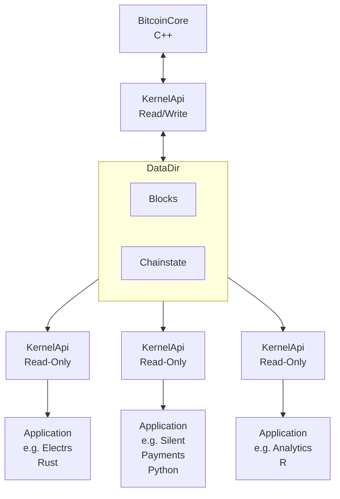

# Bitcoinkernel Readers

## Goal

**Bitcoinkernel readers** is a project to implement a **blockfiles read-only mode** to libbitcoinkernel.

## Context
Currently, bitcoinkernel instances can not run in parallel due to **LevelDB's exclusive locking**. The blockfiles read-only mode will enable an architecture where a data directory is shared between a bitcoinkernel instance (belonging to a fully functional bitcoin core node) and **multiple read-only bitcoinkernel instances** that expose their APIs to external applications.
[TheCharlatan](https://github.com/TheCharlatan) has already proposed a change to [introduce an initial C API](https://github.com/bitcoin/bitcoin/pull/30595) and [replace the leveldb-based BlockTreeDB with a flat-file based store](https://github.com/bitcoin/bitcoin/pull/32427) which **lays the foundation** for the feature.

Continuing work on both proposed changes has allowed for the functionality to be tested in my [blocktreestore-on-kernelApi](https://github.com/alexanderwiederin/bitcoin/commits/blocktreestore-on-kernelApi/) branch in bitcoin core, which I have used in conjunction with [rust-bitcoinkernel](https://github.com/alexanderwiederin/rust-bitcoinkernel/tree/test-blocktreestore-on-kernelApi) to build an end-to-end POC on Signet.

## Benefits

The benefits of this architecture include **resource sharing** between multiple bitcoinkernel instances and **further realizing bitcoinkernel's original goals**:
- Removing Bitcoin Core's **RPC bottleneck**
- Achieving **performance improvements** through elimination of serialization/deserialization overhead
- Improving **dependency inversion** through API abstraction

> Side Effect: Integration of BitcoinKernel's C Header Bindings will lead to improved feedback for BictoinKernel's API design.

## Limitations

⚠️ In its current form the feature can only **read blockfiles data**. Chainstate (including the UTXO set) is still stored in LevelDB (even with @TheCharlatan's proposed changes). **UTXO based operations are therefore not functional** for reader instances and **validation is compromised**.

## Architecture Comparison

### Current Architecture

### Target Architecture

