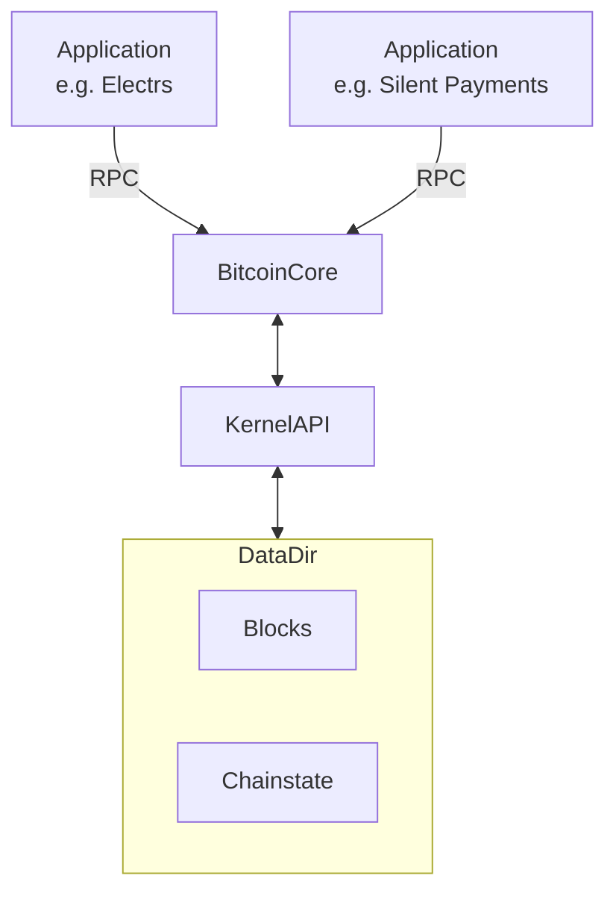

# Bitcoinkernel Blockreader

## Goal

**Bitcoinkernel's Blockreader** is a project to implement a **read only block access interface** to libbitcoinkernel, enabling multi-instance data access.

## Context
Currently, bitcoinkernel instances can not run in parallel due to **LevelDB's exclusive locking**. The blockreaders will enable an architecture where a data directory is shared between a bitcoinkernel instance belonging to a fully functional bitcoin core node and **multiple blockreaders** that expose their APIs to external applications.
[TheCharlatan](https://github.com/TheCharlatan) has already proposed a change to [introduce an initial C API](https://github.com/bitcoin/bitcoin/pull/30595) and [replace the leveldb-based BlockTreeDB with a flat-file based store](https://github.com/bitcoin/bitcoin/pull/32427) which **lays the foundation** for the project.

Continuing work on both proposed changes has allowed for the functionality to be tested in my [blockreader](https://github.com/alexanderwiederin/bitcoin/tree/blockreader/) branch in bitcoin core, which I have used in conjunction with [rust-bitcoinkernel](https://github.com/alexanderwiederin/rust-bitcoinkernel/tree/test-blocktreestore-on-kernelApi) to build an end-to-end POC on Signet.

## Benefits

The benefits of this architecture include **resource sharing** between multiple bitcoinkernel instances and **further realizing bitcoinkernel's original goals**:
- Removing Bitcoin Core's **RPC bottleneck**
- Achieving **performance improvements** through elimination of serialization/deserialization overhead
- **Dependency inversion** through API abstraction

> Side Effect: Integration of BitcoinKernel's C Header Bindings in downstream applications will lead to improved feedback for BictoinKernel's API design.

## Limitations

- In its current form the feature can only **read blockfiles data**. Chainstate (including the UTXO set) is still stored in LevelDB (even with @TheCharlatan's proposed changes). **UTXO based operations are therefore not supported** for reader instances.
- The envisioned architecture will require a specifc version of bitcoin core to run 

## Next Steps

### Core Development

- **Refine blockreader implementation** in Bitcoin Core
- **Implement increased flushing** in Bitcoin Core to improve synchroninization between read-only instances 
- **Expand language bindings** - expand langugage bindings to support blockreaders

### Validation

- **Validate functionality** - test blockreaders in different scenarios
- **Performance benchmarking** - conduct tests comparing direct kernel access vs Bitcoin Core's RPC
- **Stress testing** - validate stability under high-load scenarios with multiple concurrent blockreader instances

### Integration

- **Downstream application integration** - pilot implementation with applications like Electrs

### Potential Enhancement

- **Chainstate read-only access** - explore solutions for UTXO-based operations without LevelDB conflicts
- **Community feedback** - gather input for kernel API design through real-world usage

## Architecture Comparison

### Current Architecture

### Target Architecture

